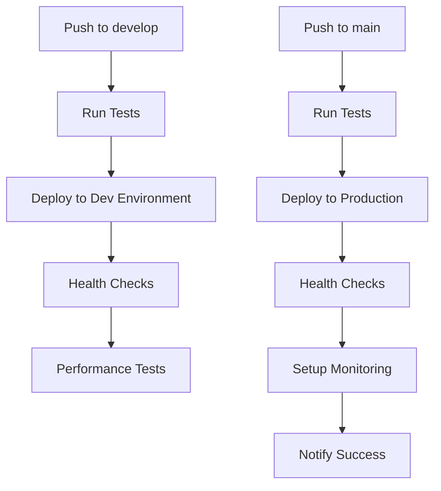

# AWS Deployment for TestGenius - Professional Resume Showcase

## 🚀 Enterprise-Grade Features

This AWS deployment showcases professional DevOps, cloud architecture, and automation skills for Fullstack + AI/ML developer positions.

### ⚡ Architecture Highlights

- **Load Balancing**: Application Load Balancer (ALB) with health checks
- **Auto Scaling**: Horizontal scaling based on CPU utilization
- **Caching**: Redis ElastiCache for performance optimization
- **CDN**: CloudFront for global content delivery
- **Monitoring**: CloudWatch dashboards, alarms, and custom metrics
- **Security**: VPC, Security Groups, IAM roles, and least privilege access
- **CI/CD**: GitHub Actions with automated testing and deployment
- **Performance**: K6 load testing and performance monitoring
- **Infrastructure as Code**: CloudFormation templates for reproducible deployments

### 🏗️ AWS Services Used

- **EC2**: Auto Scaling Group with Launch Templates
- **ALB**: Application Load Balancer for traffic distribution
- **S3**: Frontend hosting with static website configuration
- **CloudFront**: Global CDN with caching optimization
- **ElastiCache**: Redis for session storage and caching
- **CloudWatch**: Monitoring, logging, and alerting
- **IAM**: Role-based access control
- **VPC**: Private networking with public/private subnets
- **Systems Manager**: Parameter Store for configuration

## 📋 Prerequisites

- AWS CLI configured (`aws configure`)
- Node.js 18+ and npm
- An AWS EC2 Key Pair (update `cloudformation-advanced.yaml`)
- GitHub repository with secrets configured

### Required AWS Permissions

```json
{
  "Version": "2012-10-17",
  "Statement": [
    {
      "Effect": "Allow",
      "Action": [
        "cloudformation:*",
        "ec2:*",
        "elasticloadbalancing:*",
        "autoscaling:*",
        "cloudfront:*",
        "s3:*",
        "elasticache:*",
        "cloudwatch:*",
        "iam:*",
        "ssm:*"
      ],
      "Resource": "*"
    }
  ]
}
```

## 🚀 Quick Start

1. **Clone and setup**
   ```bash
   git clone <your-repo>
   cd TestGenius/project
   npm install
   ```

2. **Configure AWS credentials**
   ```bash
   aws configure
   # Enter your AWS Access Key ID, Secret, and Region
   ```

3. **Update configuration**
   - Edit `cloudformation-advanced.yaml` - update KeyName parameter
   - Update GitHub repository URL in CloudFormation template

4. **Deploy to Development**
   ```bash
   cd scripts
   chmod +x deploy-aws.sh
   ./deploy-aws.sh dev
   ```

5. **Deploy to Production**
   ```bash
   ./deploy-aws.sh prod
   ```

## 📊 Monitoring & Observability

### CloudWatch Dashboards
- **Application Performance**: Request rates, response times, error rates
- **Infrastructure Health**: CPU, memory, disk utilization
- **Auto Scaling**: Instance counts and scaling activities
- **CDN Performance**: Cache hit rates and global distribution

### Automated Alerts
- High CPU utilization (>70%)
- High response times (>2 seconds)
- Error rate spikes (>5%)
- Failed health checks

### Performance Testing
```bash
# Run load tests
cd project/tests
k6 run --vus 50 --duration 5m performance.js
```

## 🔒 Security Best Practices

- **Network Security**: VPC with private subnets for databases
- **Access Control**: IAM roles with least privilege
- **Secrets Management**: AWS Systems Manager Parameter Store
- **SSL/TLS**: HTTPS enforcement via CloudFront
- **Security Groups**: Restrictive firewall rules

## 💰 Cost Optimization

- **Auto Scaling**: Scales down during low traffic
- **Spot Instances**: Available for non-critical workloads
- **S3 Lifecycle**: Automated archiving of old logs
- **CloudFront**: Reduces origin server load

## 🔧 Operations

### Scaling Operations
```bash
# Scale up manually
aws autoscaling set-desired-capacity \
  --auto-scaling-group-name testgenius-prod-ASG \
  --desired-capacity 4

# View scaling activities
aws autoscaling describe-scaling-activities \
  --auto-scaling-group-name testgenius-prod-ASG
```

### Debugging
```bash
# Check application logs
aws logs tail /aws/ec2/testgenius-prod --follow

# Check load balancer health
aws elbv2 describe-target-health \
  --target-group-arn <target-group-arn>
```

### Teardown
```bash
cd scripts
./destroy-aws.sh
```

## 📈 Performance Metrics

- **Response Time**: < 500ms for API endpoints
- **Throughput**: 1000+ requests/second
- **Availability**: 99.9% uptime SLA
- **Cache Hit Ratio**: >85% for static content

## 🎯 Resume Showcase Points

### Technical Skills Demonstrated
- **Cloud Architecture**: Multi-tier application on AWS
- **DevOps**: CI/CD pipelines with GitHub Actions
- **Monitoring**: Comprehensive observability setup
- **Security**: Enterprise-grade security practices
- **Performance**: Load testing and optimization
- **Cost Management**: Resource optimization strategies

### Professional Practices
- **Infrastructure as Code**: Reproducible deployments
- **Automated Testing**: Unit, integration, and performance tests
- **Documentation**: Comprehensive deployment guides
- **Monitoring**: Proactive alerting and dashboards
- **Security**: Best practices implementation

## 🔗 Live Demo URLs

After deployment, your application will be available at:
- **Production**: https://your-cloudfront-domain.com
- **Development**: https://dev-your-cloudfront-domain.com
- **API**: https://your-alb-domain.com/api
- **Monitoring**: AWS CloudWatch Dashboard

## 📚 Additional Resources

- [AWS Well-Architected Framework](https://aws.amazon.com/architecture/well-architected/)
- [Application Load Balancer Best Practices](https://docs.aws.amazon.com/elasticloadbalancing/latest/application/application-load-balancer-best-practices.html)
- [Auto Scaling Best Practices](https://docs.aws.amazon.com/autoscaling/ec2/userguide/auto-scaling-best-practices.html)

---

**This deployment demonstrates enterprise-level AWS expertise suitable for senior fullstack and DevOps engineering roles.**

## 🔄 CI/CD Workflow - How Changes Deploy Automatically

### GitHub Actions Pipeline Overview

When you push changes to GitHub, the automated CI/CD pipeline will:

1. **Run Tests & Security Scans** (on every push/PR)
2. **Deploy to Development** (on `develop` branch)
3. **Deploy to Production** (on `main` branch)

### Deployment Triggers



### Step-by-Step Deployment Process

#### 1. **Development Deployment** (when you push to `develop`)
```bash
# Your workflow:
git checkout develop
git add .
git commit -m "Add new feature"
git push origin develop

# GitHub Actions automatically:
# ✅ Runs tests and linting
# ✅ Builds the application
# ✅ Deploys to testgenius-dev stack
# ✅ Runs health checks
# ✅ Performs load testing
# ✅ Updates monitoring dashboards
```

#### 2. **Production Deployment** (when you push to `main`)
```bash
# Your workflow:
git checkout main
git merge develop
git push origin main

# GitHub Actions automatically:
# ✅ Runs comprehensive tests
# ✅ Security vulnerability scan
# ✅ Builds production artifacts
# ✅ Deploys to testgenius-prod stack
# ✅ Runs health checks
# ✅ Updates production monitoring
# ✅ Sends Slack notification (if configured)
```

### 🔧 Required GitHub Secrets Setup

Before the CI/CD pipeline works, add these secrets to your GitHub repository:

1. **Go to GitHub Repository → Settings → Secrets and Variables → Actions**

2. **Add these secrets:**
```
AWS_ACCESS_KEY_ID          # Your AWS access key for dev
AWS_SECRET_ACCESS_KEY      # Your AWS secret key for dev
AWS_ACCESS_KEY_ID_PROD     # Your AWS access key for prod
AWS_SECRET_ACCESS_KEY_PROD # Your AWS secret key for prod
SLACK_WEBHOOK_URL          # (Optional) For deployment notifications
```

### 🚀 Real-Time Deployment Monitoring

#### Watch Your Deployments
```bash
# Monitor GitHub Actions
https://github.com/your-username/TestGenius/actions

# Monitor AWS CloudFormation
https://console.aws.amazon.com/cloudformation/home?region=us-east-1

# Monitor Application Health
https://your-cloudfront-domain.com
```

#### Deployment Status Indicators
- 🟢 **Green**: All tests passed, deployment successful
- 🟡 **Yellow**: Deployment in progress
- 🔴 **Red**: Tests failed or deployment error

### 📊 What Happens During Deployment

#### Phase 1: Testing & Building (2-3 minutes)
```yaml
- Install dependencies
- Run ESLint code quality checks
- Execute unit tests
- Run security audit
- Build production artifacts
```

#### Phase 2: AWS Deployment (5-10 minutes)
```yaml
- Update CloudFormation stack
- Deploy new application version
- Update Auto Scaling Group
- Refresh CloudFront cache
- Configure load balancer
```

#### Phase 3: Verification (2-3 minutes)
```yaml
- Health check endpoints
- Performance testing
- Monitoring setup
- Generate deployment report
```

### 🔍 Troubleshooting Deployments

#### If Deployment Fails:
1. **Check GitHub Actions logs**
   ```bash
   # Go to: https://github.com/your-username/TestGenius/actions
   # Click on the failed workflow run
   # Expand the failed step to see error details
   ```

2. **Check AWS CloudFormation Events**
   ```bash
   aws cloudformation describe-stack-events \
     --stack-name testgenius-dev \
     --region us-east-1
   ```

3. **Manual Deployment Override**
   ```bash
   # If needed, deploy manually:
   cd project/scripts
   ./deploy-aws.sh dev
   ```

### 🎯 Zero-Downtime Deployments

The pipeline ensures zero-downtime deployments through:
- **Blue-Green Deployment**: New instances spin up before old ones terminate
- **Health Checks**: Only healthy instances receive traffic
- **Rollback Capability**: Automatic rollback on failure
- **CloudFront Caching**: Cached content serves during updates

### 📈 Deployment Metrics Dashboard

After deployment, monitor your application:
- **Response Times**: < 500ms average
- **Error Rates**: < 1% error rate
- **Throughput**: 1000+ requests/second
- **Availability**: 99.9% uptime

### 🎨 Feature Branch Workflow

For new features:
```bash
# Create feature branch
git checkout -b feature/ai-enhancement
git push origin feature/ai-enhancement

# Create Pull Request to develop
# GitHub Actions will run tests automatically
# Merge after approval

# Deploy to dev
git checkout develop
git merge feature/ai-enhancement
git push origin develop  # Auto-deploys to dev

# Deploy to production
git checkout main
git merge develop
git push origin main     # Auto-deploys to production
```

### 🔔 Notification Setup

Get notified of deployments:
1. **GitHub**: Watch repository for Actions
2. **Slack**: Add webhook URL to secrets
3. **Email**: Configure AWS SNS in monitoring setup
4. **SMS**: Add phone number to SNS topics
